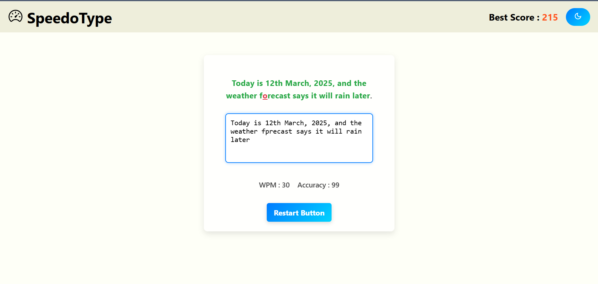
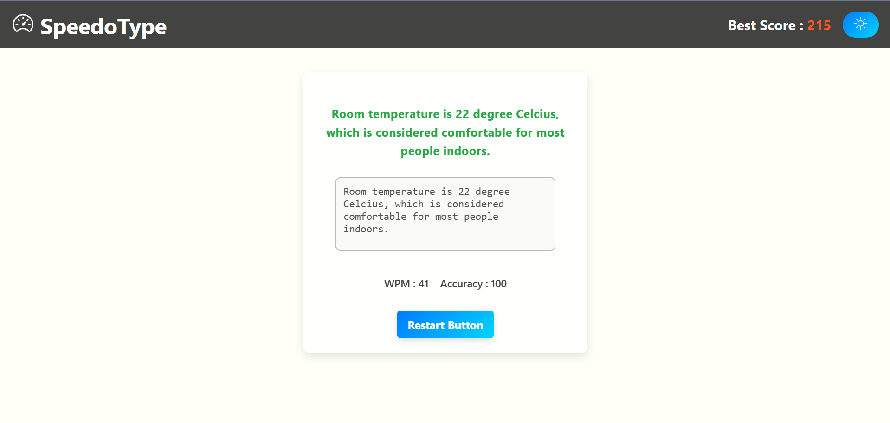

<!-- Header Banner -->

  

<h2 align="center">⚡ A Modern Typing Speed Test App with Animations & Scoring</h2>

  
  
  

---

## ✨ Overview

**Speedometer** is a sleek, fully responsive **typing speed test** app built using **React.js** and **Vite**. It tracks:

- 🕒 **WPM (Words Per Minute)**
- 🎯 **Typing Accuracy**
- 🔁 **Timed and Word Count Modes**
- 💾 **Best Score Tracking**
- 🌗 **Dark/Light Theme Toggle**
- 🎥 **Smooth UI Animations & Auto-scrolling**
- 📚 **Dynamic question set stored as arrays**

---

## 🔥 Features

| Feature              | Description |
|----------------------|-------------|
| 🚀 **Real-Time WPM** | Live calculation of your WPM while you type |
| 🎯 **Accuracy Meter** | See how accurately you're typing |
| 🌙 **Dark/Light Themes** | Toggle between modern dark/light UI |
| 🏆 **Highest Score Memory** | Stores the best scorer in browser storage |
| 📜 **Question Pool** | Array of dynamic, auto-scrolling typing prompts |

---

## 📸 Screenshots

| Light Theme                              | Dark Theme                               |
|-------------------------------------------|-------------------------------------------|
|      |       |

---

## ⚙️ Tech Stack

- **Frontend**: React.js (with Hooks)
- **Bundler**: Vite
- **Styling**: CSS
- **Data**: JavaScript Arrays (for questions), LocalStorage (for best scores)

---

## 🚧 How It Works

1. **Loads a set of words/sentences** from a pre-defined array.
2. **User types in real-time** → WPM & accuracy tracked live.
3. **Best score saved** to local storage and displayed after each session.

